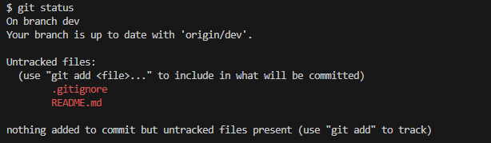

# Recipe API

## Overview

With this recipe API, you can retrieve (in JSON format), and submit recipes into a database.

## **Getting started guide**

This API is not hosted and thus will need to be installed on your local machine.

> [!IMPORTANT]
> You will need:

- [ ]  MySQL database

### Installing

#### 1. Clone the Repository

Using Git, copy these files into a folder.
Use this command:

```
git clone https://github.com/ChloeSAPage/Rat-Bot.git
```

#### 2. Install the requirements

```
pip install -r requirements.txt
```

#### 3. Create a config file in the root directory and add your SQL details.

> [!IMPORTANT]

The file should be formatted as such, with the appropriate details:

```
HOST = "localhost"
USER = ""
PASSWORD = ""
```

#### 5. Manually create a DB

Use the supplied code in the `/DB_SETUP` directory to create a MySQL database.


#### 4. Run

1. Run app.py
2. Run main.py
3. Follow instructions in command line

## EndPoints

### Get all recipes

- Endpoint: `/get-recipes`
- Method: GET
- Response: JSON

### Get one recipe

- Endpoint: `/get-recipe/<id>`
- Method: GET
- Parameters: `recipe-id` (required).
- Response: JSON


### Submit a recipe

- Endpoint: `/submit-recipe/`
- Method: PUT
- Response: 201

# Git Section

## Checking the status



## Creating the branch


## Adding files to branch


## Commits

## Pull request

## Merging with main
