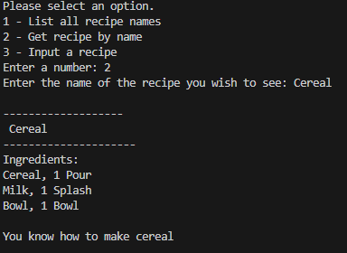
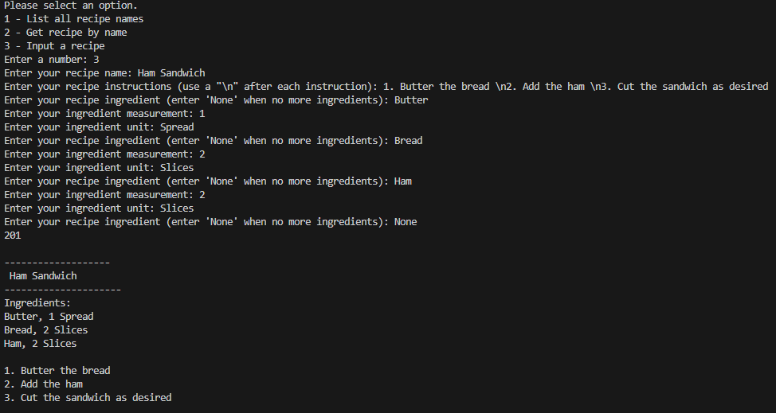
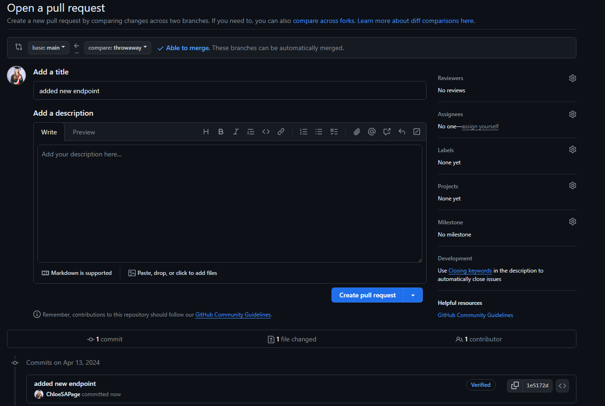
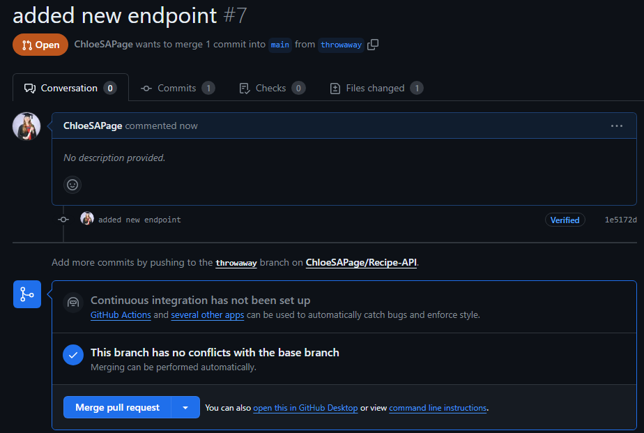
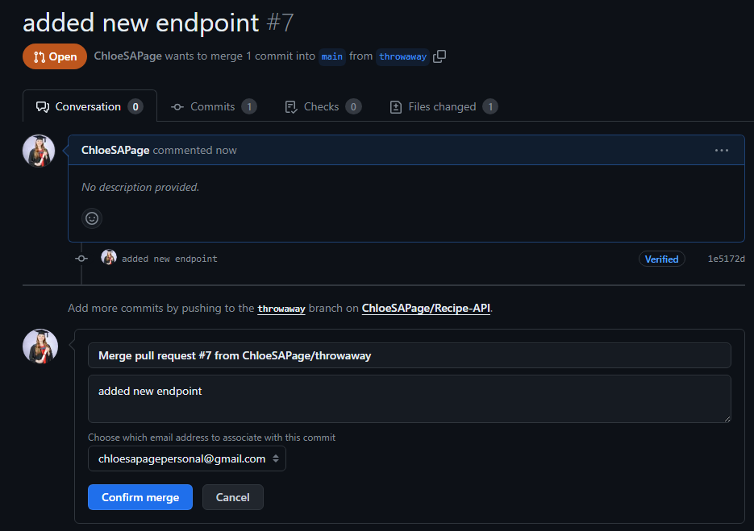

# Recipe API

## Overview

This CLI app allows you to interact with and modify a MySQL cookbook database using an API.

## **Getting started guide**

This API is _not_ hosted and thus will need to be installed on your local machine.

> [!IMPORTANT]
> You will need:
>
> -   [ ] MySQL

### Installing

#### 1. Clone the Repository

Using Git, copy these files into a folder.
Use this command:

```
git clone https://github.com/ChloeSAPage/Recipe-API.git
```

#### 2. Install the requirements

```
pip install -r requirements.txt
```

#### 3. Edit the config.py file in the root directory and add your SQL details.

> [!WARNING]
> **The file should be formatted as such, with the appropriate details. Otherwise it will _not_ work**

```
HOST = "localhost"
USER = ""
PASSWORD = ""
```

#### 4. Manually create a DB

> [!WARNING]
> Use the supplied code in the `/DB_SETUP` directory to manually create a MySQL database. **A DB will _not_ be automatically created**

#### 5. Run

> [!CAUTION]
> Running the files in a different order may cause issues.

1. Run app.py
2. Run main.py
3. Follow instructions in command line

## EndPoints

### Get all recipes

-   Endpoint: `/get-recipes`
-   Method: GET
-   Response: JSON

### Get one recipe

-   Endpoint: `/get-recipe/<name>`
-   Method: GET
-   Parameters: `recipe-name` (required).
-   Response: JSON

### Submit a recipe

-   Endpoint: `/submit-recipe/`
-   Method: PUT
-   Response: 201

## Error Handling

The API returns the appropriate HTTP status code.

# Example Usage

> [!CAUTION]
> Case sensitive

## Requesting all recipe names


## Get a specific recipe by name



## Adding a recipe



# Git Section [^1]

<details>
<summary>Click here</summary>

## Checking the status


## Creating the branch


## Adding files to branch


## Commits


## Pull request



## Merging with main

### Request



### Confirm Merge



### Merge Success and branch deleted


## Git ignore

The .gitignore file is used to ensure files you don't wish to be shared (such as the config.py file) are not accidentally added in a commit. The files will be ignored when staging files even when using `git add .`

## Requirements.txt

This file is used to show what dependencies a repository has, for example this repo uses the following packages:

-   requests
-   mysql.connector
-   flask

The requirements file can be easily installed using the following command `pip install -r requirements.txt`

</details>

[^1]: This section will be removed after the pull request is confirmed.
